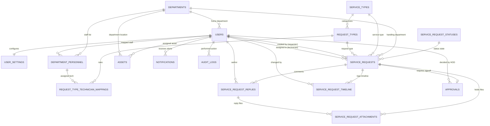

# Step 06 — Relationships, Foreign Keys & Constraints

## 1. Objective

Define all primary keys, foreign key relationships, unique constraints, check constraints, and conceptual ER diagrams for the 16 core database entities.

---

## 2. Why This Step Is Required

Explicit foreign key mapping prevents orphaned records, ensures relational integrity in SQL Server, and defines navigation properties for EF Core queries.

---

## 3. Prerequisites

* Step 05 (Models and Entities) completed.

---

## 4. What Needs To Be Done

1. Map primary key to foreign key relationships for all 16 core entities.
2. Identify unique constraints (`EmployeeId`, `Email`, `DepartmentCode`, `ServiceTypeCode`, `RequestTypeName`, `RequestNumber`, `AssetTag`, `SerialNumber`).
3. Identify check constraints (`LEN(Description) >= 20`, `BookValue >= 0`).
4. Validate relationship cardinality (One-to-One, One-to-Many, Many-to-Many).
5. Document Mermaid and Text ER diagrams.

---

## 5. Project-Specific Requirements

### 1. Foreign Key Mapping Tree
```text
User (UserId PK)
 ├── UserSettings (UserId PK/FK -> User)
 ├── DepartmentPersonnel (UserId FK -> User)
 ├── ServiceRequest [Requester] (RequesterUserId FK -> User)
 ├── ServiceRequest [Assignee] (AssigneeUserId FK -> User)
 ├── ServiceRequestReply (AuthorUserId FK -> User)
 ├── ServiceRequestTimeline (ChangedByUserId FK -> User)
 ├── ServiceRequestAttachment (UploadedByUserId FK -> User)
 ├── Approval (DecidedByUserId FK -> User)
 ├── Asset (AssignedToUserId FK -> User)
 ├── Notification (UserId FK -> User)
 └── AuditLog (ActorUserId FK -> User)

Department (DepartmentId PK)
 ├── User (DepartmentId FK -> Department)
 ├── DepartmentPersonnel (DepartmentId FK -> Department)
 ├── ServiceRequest (DepartmentId FK -> Department)
 └── Asset (DepartmentId FK -> Department)

DepartmentPersonnel (DepartmentPersonnelId PK)
 └── RequestTypeTechnicianMapping (DepartmentPersonnelId FK -> DepartmentPersonnel)

ServiceType (ServiceTypeId PK)
 ├── RequestType (ServiceTypeId FK -> ServiceType)
 └── ServiceRequest (ServiceTypeId FK -> ServiceType)

RequestType (RequestTypeId PK)
 ├── RequestTypeTechnicianMapping (RequestTypeId FK -> RequestType)
 └── ServiceRequest (RequestTypeId FK -> ServiceRequest)

ServiceRequestStatus (StatusId PK)
 └── ServiceRequest (StatusId FK -> ServiceRequestStatus)

ServiceRequest (RequestId PK)
 ├── ServiceRequestReply (RequestId FK -> ServiceRequest)
 ├── ServiceRequestTimeline (RequestId FK -> ServiceRequest)
 ├── ServiceRequestAttachment (RequestId FK -> ServiceRequest)
 └── Approval (RequestId FK -> ServiceRequest)

ServiceRequestReply (ReplyId PK)
 └── ServiceRequestAttachment (ReplyId FK -> ServiceRequestReply)
```

### 2. Conceptual Mermaid ER Diagram


---

## 6. Important Decisions

* **Cascade Actions**: Use `ON DELETE NO ACTION` for core parent references (`DepartmentId`, `ServiceTypeId`, `RequestTypeId`, `UserId`) to prevent unintended mass cascade deletions. Use `ON DELETE CASCADE` only for child transaction sub-records (`UserSettings`, `ServiceRequestReply` attachments).

---

## 7. Dependencies

* **Upstream**: Step 05 (Models and Entities).
* **Downstream**: Step 07 (DbContext Planning), Step 08 (Migrations & Seed).

---

## 8. Expected Result

After completing this step:

✓ All 16 primary-foreign key relationships are mapped.
✓ Unique and check constraints are specified.
✓ ER diagram matches entity structure 100%.

---

## 9. Verification Checklist

- [ ] Confirmed 1-to-1 relationship between `User` and `UserSettings`.
- [ ] Confirmed 1-to-Many relationships for `Department`, `ServiceType`, `RequestType`.
- [ ] Confirmed dual FK references on `ServiceRequest` (`RequesterUserId` and `AssigneeUserId`).
- [ ] Verified unique constraints on `Email`, `EmployeeId`, `RequestNumber`, `AssetTag`.
- [ ] Confirmed Mermaid ER diagram representation.

---

## 10. Move To Next Step

When all checklist items are completed, move to:

**Next Step → [07_EF_Core_and_DbContext_Planning.md](file:///d:/CSE%20Sem-5%20%28A-A2%29%20Subject/%28ASP.NET%29%20ASP.NET%20Core/ASP.NET%20Project/Service_Request_Management_System/Backend%20MD%20File/07_EF_Core_and_DbContext_Planning.md)**
