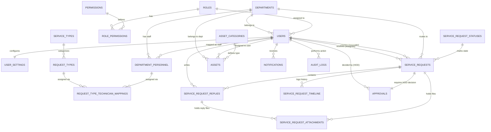

# Backend Database Blueprint - ASP.NET Core Web API
## Service Request Management System

This document outlines the detailed relational database schema design for the **Service Request Management System** backend. The design is optimized for **Microsoft SQL Server (T-SQL)** and structured to align with all frontend pages, workflows, validations, and administrative master screens.

---

## 1. Executive Summary & Design Overview

The database is designed to support a multi-role enterprise service desk supporting:
*   **Requesters**: Employees who create and track service requests and manage their assigned assets.
*   **Technicians**: IT, Maintenance, and Housekeeping personnel assigned to resolve tickets.
*   **HODs (Heads of Department)**: Department managers responsible for reviewing, approving, or rejecting high-priority/procurement requests (e.g., Software, Hardware, Access Requests) in their domain.
*   **Admins**: System administrators who manage users, configure master workflows, define mapping rules, and view global reports.

### Normalization Level
The database schema has been designed to satisfy **Third Normal Form (3NF)**:
1.  **First Normal Form (1NF)**: All attributes are atomic; there are no repeating groups, and each table has a defined primary key.
2.  **Second Normal Form (2NF)**: All non-key attributes are fully dependent on the primary key, eliminating partial dependencies.
3.  **Third Normal Form (3NF)**: Transitive dependencies have been resolved. Specifically, user profile metadata, roles, departments, request categories, statuses, and technician mappings are separated into independent lookup and master tables rather than stored as redundant strings.

### Soft Delete Strategy
To preserve audit integrity and historical reporting data (e.g., ticket resolution counts, user activity logs, and asset history), soft delete is implemented on core entity tables. A `BIT` flag `IsDeleted = 0` is default, and when marked deleted (`IsDeleted = 1`), metadata columns `DeletedAt` and `DeletedByUserId` record the deletion context. Soft-deleted items are filtered out in default queries but remain in the database for analytics.

---

## 2. Core Architectural Assumptions

1.  **Role-Based Access Control (RBAC)**: Fine-grained permissions (e.g., `requests.create`, `approvals.decide`) are stored in the database, allowing dynamic role permission checks in the ASP.NET Core Web API.
2.  **HOD Department Boundary**: A request is routed to an approval workflow if its `RequestType` matches approval-required categories. The HOD of the *target department* handling the request must approve it before it can be assigned to a technician.
3.  **Automated Assignment Logic**: When a request is raised, the system matches its `RequestTypeId` with the `RequestTypeTechnicianMappings` table to determine which active technician should be automatically assigned.
4.  **Database Currency and Value Precision**: Asset book values are stored in Indian Rupees (INR) with a precision of `DECIMAL(18,2)`.
5.  **Audit Integrity**: System audit logs are write-only. They are never soft-deleted or updated.

---

## 3. Entity Relationship Diagram (ERD)

### 3.1 Mermaid ER Diagram



### 3.2 Text ER Diagram

```text
  [Roles] 1 ------- * [RolePermissions] * ------- 1 [Permissions]
     |
     1
     *
  [Users] 1 ------- 1 [UserSettings]
     |  \ 
     |   * --------- * [Departments]
     |                     |
     |                     1
     |                     *
     * ------- * [DepartmentPersonnel] (HOD / Tech)
                   |             |
                   1             1
                   *             *
  [RequestTypes] 1 * -- [RequestTypeTechnicianMappings]
     |
     *
     1
  [ServiceTypes]

  [ServiceRequests] * ------- 1 [ServiceRequestStatuses]
     |    |    |   \______
     |    |    |          1
     1    1    1          1
     *    *    *          1
  [Timeline] [Replies] [Approvals] 
     |         |          |
     |         1          *
     |         *          | (DecidedBy)
     |    [Attachments]   |
     \__________________ /________ * [Users] (Requester, Assignee, HOD)
```

---

## 4. Detailed Database Tables (Schema Blueprints)

### 4.1 Lookup & Master Tables

#### 4.1.1 `dbo.Roles`
*   **Purpose**: Stores authorization roles defined in the system.
*   **Soft Delete**: No (Hard deleted only by system migrations).

| Column Name | Data Type | Nullability | Default Value | Constraints / Key | Description |
| :--- | :--- | :--- | :--- | :--- | :--- |
| **RoleId** | `INT` | NOT NULL | *Identity(1,1)* | **PK** | Unique identifier for the role. |
| **RoleName** | `NVARCHAR(50)` | NOT NULL | None | **UNIQUE** | Role name (e.g., 'Admin', 'HOD', 'Technician', 'Requestor'). |
| **Description** | `NVARCHAR(250)` | NULL | None | None | Explanatory note about the role's scope. |
| **CreatedAt** | `DATETIME2` | NOT NULL | `SYSUTCDATETIME()` | None | Record creation timestamp. |
| **UpdatedAt** | `DATETIME2` | NOT NULL | `SYSUTCDATETIME()` | None | Record update timestamp. |

---

#### 4.1.2 `dbo.Permissions`
*   **Purpose**: Stores granular operational claims mapped in the auth context.
*   **Soft Delete**: No.

| Column Name | Data Type | Nullability | Default Value | Constraints / Key | Description |
| :--- | :--- | :--- | :--- | :--- | :--- |
| **PermissionId** | `INT` | NOT NULL | *Identity(1,1)* | **PK** | Unique identifier. |
| **PermissionKey** | `NVARCHAR(100)` | NOT NULL | None | **UNIQUE** | Programmatic claim key (e.g., 'requests.create', 'approvals.decide'). |
| **Description** | `NVARCHAR(250)` | NULL | None | None | Describes what capabilities this permission yields. |
| **CreatedAt** | `DATETIME2` | NOT NULL | `SYSUTCDATETIME()` | None | Record creation timestamp. |

---

#### 4.1.3 `dbo.Departments`
*   **Purpose**: Stores administrative units (IT, Housekeeping, Sales, Maintenance).
*   **Soft Delete**: Yes.

| Column Name | Data Type | Nullability | Default Value | Constraints / Key | Description |
| :--- | :--- | :--- | :--- | :--- | :--- |
| **DepartmentId** | `INT` | NOT NULL | *Identity(1,1)* | **PK** | Unique identifier. |
| **DepartmentName** | `NVARCHAR(100)` | NOT NULL | None | **UNIQUE** | Readable department name (e.g., 'Maintenance'). |
| **DepartmentCode** | `NVARCHAR(10)` | NOT NULL | None | **UNIQUE** | Standard short abbreviation (e.g., 'IT', 'MAINT'). |
| **Description** | `NVARCHAR(250)` | NULL | None | None | Description of department domain. |
| **IsActive** | `BIT` | NOT NULL | `1` | None | Indicates if department is active in the organization. |
| **CreatedAt** | `DATETIME2` | NOT NULL | `SYSUTCDATETIME()` | None | Record creation timestamp. |
| **UpdatedAt** | `DATETIME2` | NOT NULL | `SYSUTCDATETIME()` | None | Record update timestamp. |
| **IsDeleted** | `BIT` | NOT NULL | `0` | None | Soft delete status flag. |
| **DeletedAt** | `DATETIME2` | NULL | None | None | Time stamp of soft deletion. |
| **DeletedByUserId** | `INT` | NULL | None | **FK** -> `Users(UserId)` | User who executed soft deletion. |

*   **Indexes**:
    *   `UIX_Departments_Code` (Non-Clustered, Unique) on `DepartmentCode` WHERE `IsDeleted = 0`.
*   **Foreign Key Actions**:
    *   `DeletedByUserId`: `ON DELETE NO ACTION`

---

#### 4.1.4 `dbo.ServiceTypes`
*   **Purpose**: Stores service category boundaries (e.g., Technical, Facility, Administrative).
*   **Soft Delete**: Yes.

| Column Name | Data Type | Nullability | Default Value | Constraints / Key | Description |
| :--- | :--- | :--- | :--- | :--- | :--- |
| **ServiceTypeId** | `INT` | NOT NULL | *Identity(1,1)* | **PK** | Unique identifier. |
| **ServiceTypeName** | `NVARCHAR(50)` | NOT NULL | None | **UNIQUE** | e.g., 'Technical', 'Facility'. |
| **ServiceTypeCode** | `NVARCHAR(10)` | NOT NULL | None | **UNIQUE** | Code representation (e.g., 'TECH', 'FAC'). |
| **Description** | `NVARCHAR(250)` | NULL | None | None | Description. |
| **IsActive** | `BIT` | NOT NULL | `1` | None | Flag representing master activation. |
| **CreatedAt** | `DATETIME2` | NOT NULL | `SYSUTCDATETIME()` | None | Log timestamp. |
| **UpdatedAt** | `DATETIME2` | NOT NULL | `SYSUTCDATETIME()` | None | Log timestamp. |
| **IsDeleted** | `BIT` | NOT NULL | `0` | None | Soft delete flag. |

---

#### 4.1.5 `dbo.RequestTypes`
*   **Purpose**: Stores sub-categories under ServiceTypes (e.g., AC Repair, Computer Issue).
*   **Soft Delete**: Yes.

| Column Name | Data Type | Nullability | Default Value | Constraints / Key | Description |
| :--- | :--- | :--- | :--- | :--- | :--- |
| **RequestTypeId** | `INT` | NOT NULL | *Identity(1,1)* | **PK** | Unique identifier. |
| **RequestTypeName** | `NVARCHAR(100)` | NOT NULL | None | **UNIQUE** | e.g., 'Computer Issue', 'AV Equipment'. |
| **ServiceTypeId** | `INT` | NOT NULL | None | **FK** -> `ServiceTypes` | Links to parent service category. |
| **Description** | `NVARCHAR(250)` | NULL | None | None | Details about this request type. |
| **IsActive** | `BIT` | NOT NULL | `1` | None | Operational availability toggle. |
| **CreatedAt** | `DATETIME2` | NOT NULL | `SYSUTCDATETIME()` | None | Timestamp. |
| **UpdatedAt** | `DATETIME2` | NOT NULL | `SYSUTCDATETIME()` | None | Timestamp. |
| **IsDeleted** | `BIT` | NOT NULL | `0` | None | Soft delete flag. |

*   **Indexes**:
    *   `IX_RequestTypes_ServiceTypeId` (Non-Clustered) on `ServiceTypeId`.
*   **Foreign Key Actions**:
    *   `ServiceTypeId`: `ON DELETE NO ACTION` (Prevent deleting active categories linked to request types).

---

#### 4.1.6 `dbo.ServiceRequestStatuses`
*   **Purpose**: Stores ticket workflow statuses (e.g., Open, In Progress, Resolved).
*   **Soft Delete**: No (Static system workflow list).

| Column Name | Data Type | Nullability | Default Value | Constraints / Key | Description |
| :--- | :--- | :--- | :--- | :--- | :--- |
| **StatusId** | `INT` | NOT NULL | *Identity(1,1)* | **PK** | Unique identifier. |
| **StatusName** | `NVARCHAR(50)` | NOT NULL | None | **UNIQUE** | Status name (e.g., 'Open', 'In Progress', 'Pending Approval', 'Resolved', 'Closed', 'Cancelled', 'Assigned', 'Rejected'). |
| **ColorCode** | `VARCHAR(100)` | NULL | None | None | Tailwind class styling configurations for badge (e.g., 'bg-info/10 text-info ring-info/20'). |
| **Description** | `NVARCHAR(250)` | NULL | None | None | Description of this step in workflow. |
| **IsActive** | `BIT` | NOT NULL | `1` | None | Availability flag. |
| **CreatedAt** | `DATETIME2` | NOT NULL | `SYSUTCDATETIME()` | None | Timestamp. |

---

#### 4.1.7 `dbo.AssetCategories`
*   **Purpose**: Defines categories of physical items (e.g., Laptop, Printer, HVAC, Furniture).
*   **Soft Delete**: No.

| Column Name | Data Type | Nullability | Default Value | Constraints / Key | Description |
| :--- | :--- | :--- | :--- | :--- | :--- |
| **CategoryId** | `INT` | NOT NULL | *Identity(1,1)* | **PK** | Unique identifier. |
| **CategoryName** | `NVARCHAR(50)` | NOT NULL | None | **UNIQUE** | e.g., 'Laptop', 'HVAC'. |
| **IsActive** | `BIT` | NOT NULL | `1` | None | Toggle state. |
| **CreatedAt** | `DATETIME2` | NOT NULL | `SYSUTCDATETIME()` | None | Timestamp. |

---

### 4.2 Security & Authentication Tables

#### 4.2.1 `dbo.RolePermissions`
*   **Purpose**: Join table mapping permissions to roles (Many-to-Many).
*   **Soft Delete**: No (Direct cascading deletion when role or permission changes).

| Column Name | Data Type | Nullability | Default Value | Constraints / Key | Description |
| :--- | :--- | :--- | :--- | :--- | :--- |
| **RoleId** | `INT` | NOT NULL | None | **PK**, **FK** -> `Roles` | Mapped Role. |
| **PermissionId** | `INT` | NOT NULL | None | **PK**, **FK** -> `Permissions` | Mapped Permission. |

*   **Foreign Key Actions**:
    *   `RoleId`: `ON DELETE CASCADE`
    *   `PermissionId`: `ON DELETE CASCADE`

---

#### 4.2.2 `dbo.Users`
*   **Purpose**: Stores credential records, role alignments, and user status.
*   **Soft Delete**: Yes.

| Column Name | Data Type | Nullability | Default Value | Constraints / Key | Description |
| :--- | :--- | :--- | :--- | :--- | :--- |
| **UserId** | `INT` | NOT NULL | *Identity(1,1)* | **PK** | Unique identifier. |
| **EmployeeId** | `VARCHAR(20)` | NOT NULL | None | **UNIQUE** | Corporate ID (e.g., 'EMP-0001'). |
| **FullName** | `NVARCHAR(100)` | NOT NULL | None | None | User's full name. |
| **Email** | `NVARCHAR(256)` | NOT NULL | None | **UNIQUE** | User email address. |
| **PasswordHash** | `NVARCHAR(256)` | NOT NULL | None | None | Cryptographic hash of user's password. |
| **RoleId** | `INT` | NOT NULL | None | **FK** -> `Roles` | Primary role assignment. |
| **DepartmentId** | `INT` | NULL | None | **FK** -> `Departments` | Links to primary home department. |
| **Phone** | `NVARCHAR(20)` | NULL | None | None | Phone number. |
| **Status** | `VARCHAR(15)` | NOT NULL | `'Active'` | **CHECK** | State bounds: `Active` or `Inactive`. |
| **JoinedDate** | `DATE` | NOT NULL | `CAST(GETDATE() AS DATE)`| None | Date of onboarding. |
| **LastLoginAt** | `DATETIME2` | NULL | None | None | Tracks user's last session access. |
| **CreatedAt** | `DATETIME2` | NOT NULL | `SYSUTCDATETIME()` | None | Record created stamp. |
| **UpdatedAt** | `DATETIME2` | NOT NULL | `SYSUTCDATETIME()` | None | Record updated stamp. |
| **IsDeleted** | `BIT` | NOT NULL | `0` | None | Soft delete status. |
| **DeletedAt** | `DATETIME2` | NULL | None | None | Timestamp of deletion. |

*   **Constraints**:
    *   `CK_Users_Status`: `CHECK (Status IN ('Active', 'Inactive'))`
*   **Indexes**:
    *   `IX_Users_Email` (Non-Clustered) on `Email` WHERE `IsDeleted = 0` (Includes `PasswordHash`, `RoleId`, `Status` for authentication speed).
    *   `IX_Users_EmployeeId` (Non-Clustered) on `EmployeeId`.
*   **Foreign Key Actions**:
    *   `RoleId`: `ON DELETE NO ACTION`
    *   `DepartmentId`: `ON DELETE SET NULL`

---

#### 4.2.3 `dbo.UserSettings`
*   **Purpose**: User account configurations (Theme, notifications, 2FA settings).
*   **Soft Delete**: No (Hard deleted alongside parent user).

| Column Name | Data Type | Nullability | Default Value | Constraints / Key | Description |
| :--- | :--- | :--- | :--- | :--- | :--- |
| **UserId** | `INT` | NOT NULL | None | **PK**, **FK** -> `Users` | Links directly to parent user (One-to-One). |
| **Theme** | `VARCHAR(10)` | NOT NULL | `'light'` | **CHECK** | Design preference: `light` or `dark`. |
| **TwoFactorEnabled** | `BIT` | NOT NULL | `0` | None | Indicates if 2FA authentication is enabled. |
| **NotifyRequestUpdates**| `BIT` | NOT NULL | `1` | None | Push/email notifications on request updates. |
| **NotifyApprovalAlerts**| `BIT` | NOT NULL | `1` | None | Push/email notifications on approvals. |
| **NotifySLAWarnings** | `BIT` | NOT NULL | `1` | None | Alert on target SLA breaches. |
| **NotifyAssetEvents** | `BIT` | NOT NULL | `0` | None | Alert on asset assignments/recalls. |
| **NotifyEmailDigest** | `BIT` | NOT NULL | `0` | None | Subscribed to daily summary emails. |
| **UpdatedAt** | `DATETIME2` | NOT NULL | `SYSUTCDATETIME()` | None | Update timestamp. |

*   **Constraints**:
    *   `CK_UserSettings_Theme`: `CHECK (Theme IN ('light', 'dark'))`
*   **Foreign Key Actions**:
    *   `UserId`: `ON DELETE CASCADE` (Deletes settings if user is hard deleted).

---

### 4.3 Core Entities

#### 4.3.1 `dbo.DepartmentPersonnel`
*   **Purpose**: Join table linking Users to Departments. Designates which users are staff/technicians in a department, and identifies who is the HOD (Head of Department) for approvals routing.
*   **Soft Delete**: Yes.

| Column Name | Data Type | Nullability | Default Value | Constraints / Key | Description |
| :--- | :--- | :--- | :--- | :--- | :--- |
| **DepartmentPersonnelId**| `INT` | NOT NULL | *Identity(1,1)* | **PK** | Unique row identifier. |
| **UserId** | `INT` | NOT NULL | None | **FK** -> `Users` | Mapped employee (typically HOD or Technician). |
| **DepartmentId** | `INT` | NOT NULL | None | **FK** -> `Departments` | Targeted service department. |
| **IsHOD** | `BIT` | NOT NULL | `0` | None | `1` if the user is the Head of Department for approvals. |
| **IsActive** | `BIT` | NOT NULL | `1` | None | Toggle to activate/deactivate personnel mapping. |
| **CreatedAt** | `DATETIME2` | NOT NULL | `SYSUTCDATETIME()` | None | Timestamp. |
| **UpdatedAt** | `DATETIME2` | NOT NULL | `SYSUTCDATETIME()` | None | Timestamp. |
| **IsDeleted** | `BIT` | NOT NULL | `0` | None | Soft delete status. |

*   **Indexes**:
    *   `UIX_DeptPersonnel_UserDept` (Non-Clustered, Unique) on (`UserId`, `DepartmentId`) WHERE `IsDeleted = 0`.
*   **Foreign Key Actions**:
    *   `UserId`: `ON DELETE NO ACTION`
    *   `DepartmentId`: `ON DELETE NO ACTION`

---

#### 4.3.2 `dbo.RequestTypeTechnicianMappings`
*   **Purpose**: Defines rules to automatically assign technicians to incoming tickets based on their Request Type.
*   **Soft Delete**: Yes.

| Column Name | Data Type | Nullability | Default Value | Constraints / Key | Description |
| :--- | :--- | :--- | :--- | :--- | :--- |
| **MappingId** | `INT` | NOT NULL | *Identity(1,1)* | **PK** | Unique identifier. |
| **RequestTypeId** | `INT` | NOT NULL | None | **FK** -> `RequestTypes` | Category rule trigger. |
| **DepartmentPersonnelId**| `INT` | NOT NULL | None | **FK** -> `DepartmentPersonnel` | Technician designated for auto-assignment. |
| **IsActive** | `BIT` | NOT NULL | `1` | None | Activation toggle. |
| **CreatedAt** | `DATETIME2` | NOT NULL | `SYSUTCDATETIME()` | None | Timestamp. |
| **UpdatedAt** | `DATETIME2` | NOT NULL | `SYSUTCDATETIME()` | None | Timestamp. |
| **IsDeleted** | `BIT` | NOT NULL | `0` | None | Soft delete status. |

*   **Indexes**:
    *   `UIX_ReqTypeTech_Mapping` (Non-Clustered, Unique) on (`RequestTypeId`, `DepartmentPersonnelId`) WHERE `IsDeleted = 0`.
*   **Foreign Key Actions**:
    *   `RequestTypeId`: `ON DELETE NO ACTION`
    *   `DepartmentPersonnelId`: `ON DELETE NO ACTION`

---

#### 4.3.3 `dbo.ServiceRequests`
*   **Purpose**: Stores service tickets raised by employees.
*   **Soft Delete**: Yes.

| Column Name | Data Type | Nullability | Default Value | Constraints / Key | Description |
| :--- | :--- | :--- | :--- | :--- | :--- |
| **RequestId** | `INT` | NOT NULL | *Identity(1,1)* | **PK** | Unique identifier. |
| **RequestNumber** | `VARCHAR(20)` | NOT NULL | None | **UNIQUE** | Formatting: 'SR-YYYY-XXXX' (e.g., 'SR-2026-1041'). |
| **Title** | `NVARCHAR(150)`| NOT NULL | None | None | Summary of the request. |
| **Description** | `NVARCHAR(MAX)`| NOT NULL | None | **CHECK** | Detailed description. Checked for >= 20 characters. |
| **ServiceTypeId** | `INT` | NOT NULL | None | **FK** -> `ServiceTypes` | Mapped Service Type. |
| **RequestTypeId** | `INT` | NOT NULL | None | **FK** -> `RequestTypes` | Mapped Request Type. |
| **DepartmentId** | `INT` | NOT NULL | None | **FK** -> `Departments` | Target department handling the ticket. |
| **RequesterUserId** | `INT` | NOT NULL | None | **FK** -> `Users` | User who created the ticket. |
| **AssigneeUserId** | `INT` | NULL | None | **FK** -> `Users` | Assigned technician resolving the ticket. |
| **StatusId** | `INT` | NOT NULL | None | **FK** -> `ServiceRequestStatuses`| Ticket status. |
| **Priority** | `VARCHAR(15)` | NOT NULL | `'Medium'` | **CHECK** | Values: `Critical`, `High`, `Medium`, `Low`. |
| **CreatedAt** | `DATETIME2` | NOT NULL | `SYSUTCDATETIME()` | None | Ticket raising time. |
| **CreatedByUserId** | `INT` | NOT NULL | None | **FK** -> `Users` | User record context that created the ticket. |
| **UpdatedAt** | `DATETIME2` | NOT NULL | `SYSUTCDATETIME()` | None | Last update time. |
| **UpdatedByUserId** | `INT` | NOT NULL | None | **FK** -> `Users` | User who last modified the ticket. |
| **IsDeleted** | `BIT` | NOT NULL | `0` | None | Soft delete status flag. |
| **DeletedAt** | `DATETIME2` | NULL | None | None | Deletion timestamp. |
| **DeletedByUserId** | `INT` | NULL | None | **FK** -> `Users` | User who soft deleted the ticket. |

*   **Constraints**:
    *   `CK_ServiceRequests_Priority`: `CHECK (Priority IN ('Critical', 'High', 'Medium', 'Low'))`
    *   `CK_ServiceRequests_Desc_Len`: `CHECK (LEN(TRIM(Description)) >= 20)`
*   **Indexes**:
    *   `IX_ServiceRequests_RequestNumber` (Non-Clustered, Unique) on `RequestNumber` WHERE `IsDeleted = 0`.
    *   `IX_ServiceRequests_Requester` (Non-Clustered) on `RequesterUserId` (Included for dashboard queries).
    *   `IX_ServiceRequests_Assignee` (Non-Clustered) on `AssigneeUserId` WHERE `AssigneeUserId IS NOT NULL`.
    *   `IX_ServiceRequests_Status` (Non-Clustered) on `StatusId`.
    *   `IX_ServiceRequests_Dept` (Non-Clustered) on `DepartmentId` (Used for HOD dashboards).
*   **Foreign Key Actions**:
    *   `ServiceTypeId`, `RequestTypeId`, `DepartmentId`, `StatusId`: `ON DELETE NO ACTION`
    *   `RequesterUserId`, `AssigneeUserId`, `CreatedByUserId`, `UpdatedByUserId`, `DeletedByUserId`: `ON DELETE NO ACTION`

---

#### 4.3.4 `dbo.Assets`
*   **Purpose**: Tracks corporate hardware and facility equipment inventory.
*   **Soft Delete**: Yes.

| Column Name | Data Type | Nullability | Default Value | Constraints / Key | Description |
| :--- | :--- | :--- | :--- | :--- | :--- |
| **AssetId** | `INT` | NOT NULL | *Identity(1,1)* | **PK** | Unique identifier. |
| **AssetTag** | `VARCHAR(30)` | NOT NULL | None | **UNIQUE** | Custom identifier (e.g., 'AST-IT-0142'). |
| **AssetName** | `NVARCHAR(100)`| NOT NULL | None | None | Readable model name (e.g., 'Dell Latitude 7440'). |
| **CategoryId** | `INT` | NOT NULL | None | **FK** -> `AssetCategories` | Asset category (e.g., Laptop). |
| **SerialNumber** | `NVARCHAR(100)`| NOT NULL | None | **UNIQUE** | Manufacturer unique serial code. |
| **AssignedToUserId** | `INT` | NULL | None | **FK** -> `Users` | User currently assigned this asset (Nullable). |
| **DepartmentId** | `INT` | NULL | None | **FK** -> `Departments` | Physical department location of asset. |
| **Status** | `VARCHAR(20)` | NOT NULL | `'Available'` | **CHECK** | Values: `In Use`, `Available`, `Under Repair`, `Retired`. |
| **PurchaseDate** | `DATE` | NOT NULL | None | None | Date purchased. |
| **WarrantyUntil** | `DATE` | NOT NULL | None | None | Warranty expiry date. |
| **BookValue** | `DECIMAL(18,2)`| NOT NULL | `0.00` | None | Purchase price stored in INR. |
| **CreatedAt** | `DATETIME2` | NOT NULL | `SYSUTCDATETIME()` | None | Creation timestamp. |
| **UpdatedAt** | `DATETIME2` | NOT NULL | `SYSUTCDATETIME()` | None | Update timestamp. |
| **IsDeleted** | `BIT` | NOT NULL | `0` | None | Soft delete flag. |

*   **Constraints**:
    *   `CK_Assets_Status`: `CHECK (Status IN ('In Use', 'Available', 'Under Repair', 'Retired'))`
    *   `CK_Assets_Warranty`: `CHECK (WarrantyUntil >= PurchaseDate)`
*   **Indexes**:
    *   `IX_Assets_AssignedTo` (Non-Clustered) on `AssignedToUserId` WHERE `AssignedToUserId IS NOT NULL`.
    *   `IX_Assets_Tag` (Non-Clustered, Unique) on `AssetTag` WHERE `IsDeleted = 0`.
*   **Foreign Key Actions**:
    *   `CategoryId`: `ON DELETE NO ACTION`
    *   `AssignedToUserId`: `ON DELETE SET NULL` (Keeps asset if employee leaves/deleted).
    *   `DepartmentId`: `ON DELETE SET NULL`

---

### 4.4 Transactional & Workflow Tables

#### 4.4.1 `dbo.ServiceRequestReplies`
*   **Purpose**: Stores chat updates and comments logged on service requests.
*   **Soft Delete**: No (Direct cascade delete if the parent ticket is purged).

| Column Name | Data Type | Nullability | Default Value | Constraints / Key | Description |
| :--- | :--- | :--- | :--- | :--- | :--- |
| **ReplyId** | `INT` | NOT NULL | *Identity(1,1)* | **PK** | Unique comment ID. |
| **RequestId** | `INT` | NOT NULL | None | **FK** -> `ServiceRequests` | Parent service request ticket. |
| **AuthorUserId** | `INT` | NOT NULL | None | **FK** -> `Users` | Writer of the reply/comment. |
| **Message** | `NVARCHAR(MAX)`| NOT NULL | None | None | Text content of the comment. |
| **StatusTransitionId**| `INT` | NULL | None | **FK** -> `ServiceRequestStatuses`| Optional flag linking a status change made with comment. |
| **CreatedAt** | `DATETIME2` | NOT NULL | `SYSUTCDATETIME()` | None | Timestamp when reply was posted. |

*   **Indexes**:
    *   `IX_Replies_RequestId` (Non-Clustered) on `RequestId`.
*   **Foreign Key Actions**:
    *   `RequestId`: `ON DELETE CASCADE` (Removes replies if ticket is hard-deleted).
    *   `AuthorUserId`: `ON DELETE NO ACTION`
    *   `StatusTransitionId`: `ON DELETE NO ACTION`

---

#### 4.4.2 `dbo.ServiceRequestTimeline`
*   **Purpose**: Audit logs documenting transitions of ticket metadata (status shifts, assignments).
*   **Soft Delete**: No.

| Column Name | Data Type | Nullability | Default Value | Constraints / Key | Description |
| :--- | :--- | :--- | :--- | :--- | :--- |
| **TimelineId** | `INT` | NOT NULL | *Identity(1,1)* | **PK** | Unique timeline entry ID. |
| **RequestId** | `INT` | NOT NULL | None | **FK** -> `ServiceRequests` | Parent request. |
| **StatusId** | `INT` | NOT NULL | None | **FK** -> `ServiceRequestStatuses`| Ticket status at this timeline step. |
| **ChangedByUserId** | `INT` | NOT NULL | None | **FK** -> `Users` | User executing this timeline event. |
| **ChangedAt** | `DATETIME2` | NOT NULL | `SYSUTCDATETIME()` | None | Timestamp of change. |
| **Note** | `NVARCHAR(500)`| NOT NULL | None | None | Explanatory note (e.g., 'Status updated to In Progress'). |

*   **Indexes**:
    *   `IX_Timeline_RequestId` (Non-Clustered) on `RequestId`.
*   **Foreign Key Actions**:
    *   `RequestId`: `ON DELETE CASCADE` (Removes history if ticket is hard-deleted).
    *   `StatusId`: `ON DELETE NO ACTION`
    *   `ChangedByUserId`: `ON DELETE NO ACTION`

---

#### 4.4.3 `dbo.ServiceRequestAttachments`
*   **Purpose**: Metadata records mapping files to creation tickets or chat updates.
*   **Soft Delete**: No (Hard deleted when parent ticket/reply is deleted).

| Column Name | Data Type | Nullability | Default Value | Constraints / Key | Description |
| :--- | :--- | :--- | :--- | :--- | :--- |
| **AttachmentId** | `INT` | NOT NULL | *Identity(1,1)* | **PK** | Unique attachment ID. |
| **RequestId** | `INT` | NOT NULL | None | **FK** -> `ServiceRequests` | Ticket this file is uploaded under. |
| **ReplyId** | `INT` | NULL | None | **FK** -> `ServiceRequestReplies` | Reply comment this file belongs to (NULL if uploaded during creation). |
| **FileName** | `NVARCHAR(256)`| NOT NULL | None | None | Original upload filename. |
| **FileSizeKB** | `INT` | NOT NULL | None | None | Size of the file in kilobytes. |
| **FileUrl** | `NVARCHAR(2048)`| NOT NULL | None | None | Full path or URL to cloud/disk file storage. |
| **UploadedByUserId**| `INT` | NOT NULL | None | **FK** -> `Users` | User who uploaded the attachment. |
| **UploadedAt** | `DATETIME2` | NOT NULL | `SYSUTCDATETIME()` | None | Timestamp. |

*   **Indexes**:
    *   `IX_Attachments_RequestId` (Non-Clustered) on `RequestId`.
    *   `IX_Attachments_ReplyId` (Non-Clustered) on `ReplyId` WHERE `ReplyId IS NOT NULL`.
*   **Foreign Key Actions**:
    *   `RequestId`: `ON DELETE CASCADE`
    *   `ReplyId`: `ON DELETE CASCADE` (Clean cascades: if reply is removed, its attachments are cleared).
    *   `UploadedByUserId`: `ON DELETE NO ACTION`

---

#### 4.4.4 `dbo.Approvals`
*   **Purpose**: Stores sign-off states for tickets that require HOD approval (Software, Hardware, Access Requests).
*   **Soft Delete**: No.

| Column Name | Data Type | Nullability | Default Value | Constraints / Key | Description |
| :--- | :--- | :--- | :--- | :--- | :--- |
| **ApprovalId** | `INT` | NOT NULL | *Identity(1,1)* | **PK** | Unique approval ticket ID. |
| **RequestId** | `INT` | NOT NULL | None | **FK** -> `ServiceRequests` | Target ticket needing decision. |
| **Status** | `VARCHAR(15)` | NOT NULL | `'Pending'` | **CHECK** | Values: `Pending`, `Approved`, `Rejected`. |
| **DecidedByUserId** | `INT` | NULL | None | **FK** -> `Users` | HOD user who approved or rejected the ticket (Nullable until decided). |
| **DecidedAt** | `DATETIME2` | NULL | None | None | Timestamp of action. |
| **Remarks** | `NVARCHAR(1000)`| NULL | None | None | Rejection/approval reason description. |
| **SubmittedAt** | `DATETIME2` | NOT NULL | `SYSUTCDATETIME()` | None | Submission request date. |

*   **Constraints**:
    *   `CK_Approvals_Status`: `CHECK (Status IN ('Pending', 'Approved', 'Rejected'))`
*   **Indexes**:
    *   `IX_Approvals_RequestId` (Non-Clustered) on `RequestId`.
    *   `IX_Approvals_PendingHOD` (Non-Clustered) on `DecidedByUserId` WHERE `Status = 'Pending'`.
*   **Foreign Key Actions**:
    *   `RequestId`: `ON DELETE CASCADE`
    *   `DecidedByUserId`: `ON DELETE NO ACTION`

---

### 4.5 Audit & Logging Tables

#### 4.5.1 `dbo.Notifications`
*   **Purpose**: User inbox alerts for real-time signaling (e.g., ticket assignments, approval cues).
*   **Soft Delete**: No.

| Column Name | Data Type | Nullability | Default Value | Constraints / Key | Description |
| :--- | :--- | :--- | :--- | :--- | :--- |
| **NotificationId** | `INT` | NOT NULL | *Identity(1,1)* | **PK** | Unique notification ID. |
| **UserId** | `INT` | NOT NULL | None | **FK** -> `Users` | User receiving this alert. |
| **Title** | `NVARCHAR(150)`| NOT NULL | None | None | Header of notification. |
| **Message** | `NVARCHAR(500)`| NOT NULL | None | None | Context details message. |
| **IsRead** | `BIT` | NOT NULL | `0` | None | `1` if read, else `0`. |
| **NotificationType**| `VARCHAR(20)` | NOT NULL | None | **CHECK** | Values: `request`, `approval`, `asset`, `system`. |
| **CreatedAt** | `DATETIME2` | NOT NULL | `SYSUTCDATETIME()` | None | Creation timestamp. |

*   **Constraints**:
    *   `CK_Notifications_Type`: `CHECK (NotificationType IN ('request', 'approval', 'asset', 'system'))`
*   **Indexes**:
    *   `IX_Notifications_UnreadInbox` (Non-Clustered, Filtered) on `UserId` WHERE `IsRead = 0`.
*   **Foreign Key Actions**:
    *   `UserId`: `ON DELETE CASCADE` (Deletes notifications if user is deleted).

---

#### 4.5.2 `dbo.AuditLogs`
*   **Purpose**: Log user activities and system-wide modifications (Write-only).
*   **Soft Delete**: No.

| Column Name | Data Type | Nullability | Default Value | Constraints / Key | Description |
| :--- | :--- | :--- | :--- | :--- | :--- |
| **AuditLogId** | `BIGINT` | NOT NULL | *Identity(1,1)* | **PK** | BigInt unique identifier. |
| **ActorUserId** | `INT` | NULL | None | **FK** -> `Users` | User performing action (NULL if System). |
| **Action** | `NVARCHAR(100)`| NOT NULL | None | None | Action description (e.g., 'updated status of', 'approved'). |
| **TargetType** | `VARCHAR(50)` | NOT NULL | None | None | Target model schema category (e.g., 'ServiceRequest', 'Asset'). |
| **TargetId** | `VARCHAR(50)` | NULL | None | None | ID of targeted entity record. |
| **TargetDisplay** | `NVARCHAR(100)`| NULL | None | None | Readable text summary tag (e.g., 'SR-2026-1041'). |
| **Detail** | `NVARCHAR(MAX)`| NULL | None | None | Detailed audit metadata description. |
| **IpAddress** | `VARCHAR(45)` | NULL | None | None | IP address performing transaction (Supports IPv4/IPv6). |
| **CreatedAt** | `DATETIME2` | NOT NULL | `SYSUTCDATETIME()` | None | Timestamp. |

*   **Indexes**:
    *   `IX_AuditLogs_Search` (Non-Clustered) on `CreatedAt` (Includes `ActorUserId`, `Action`, `TargetDisplay`).
*   **Foreign Key Actions**:
    *   `ActorUserId`: `ON DELETE NO ACTION`

---

## 5. Summary of Enums and Permitted Value Bounds

Several columns are restricted to explicit sets of string literals to ensure data validation.

| Table Name | Column Name | Allowed Enumerated Value Set |
| :--- | :--- | :--- |
| `Users` | `Status` | `'Active'`, `'Inactive'` |
| `UserSettings` | `Theme` | `'light'`, `'dark'` |
| `ServiceRequests` | `Priority` | `'Critical'`, `'High'`, `'Medium'`, `'Low'` |
| `Approvals` | `Status` | `'Pending'`, `'Approved'`, `'Rejected'` |
| `Assets` | `Status` | `'In Use'`, `'Available'`, `'Under Repair'`, `'Retired'` |
| `Notifications` | `NotificationType` | `'request'`, `'approval'`, `'asset'`, `'system'` |

---

## 6. Authentication and RBAC Flow Architecture

Authentication and authorization require a secure implementation mapping:

```
[JWT Credentials] -> Map to User -> Query RoleId -> Fetch Permissions (RolePermissions join)
```

1.  **Identity Verification**: The ASP.NET Core API uses JWT Bearer authentication. When a user requests a token, the API queries `dbo.Users` by `Email`, validates the `PasswordHash` using `BCrypt` or `PBKDF2`, and records the login timestamp in `LastLoginAt`.
2.  **Role/Claim Mapping**: The token payload embeds claims for:
    *   `UserId`
    *   `EmployeeId`
    *   `role` (mapping to `RoleName` via `RoleId`)
    *   `department` (mapping to `DepartmentName` via `DepartmentId`)
3.  **Dynamic Claim Authorization**: During execution, controllers or services check claims. The permissions mapped in `dbo.RolePermissions` for the user's role are loaded into authorization claims (e.g., `requests.create`, `approvals.decide`, etc.) to enforce API route security.

---

## 7. File Attachment Storage Strategy

For scalability and cost-efficiency, files uploaded from the React dropzone should not be stored directly inside the relational database as binary large objects (`VARBINARY(MAX)`). Instead, a hybrid cloud-metadata strategy is recommended:

1.  **Storage Target**: Files are uploaded to external object storage (e.g., **Azure Blob Storage** or **AWS S3**).
2.  **Unique Mapping**: Upon upload, the backend generates a unique GUID filename (e.g., `5f89c3db-24b5-4b1f-9ae2-581ef5f72da0.pdf`) to avoid naming collisions and writes the file to a container.
3.  **Database Recording**: In the `dbo.ServiceRequestAttachments` table, the API logs the upload detail:
    *   `FileName` (stores the original name, e.g. `screenshot_error.png` for user recognition)
    *   `FileSizeKB` (calculated in backend)
    *   `FileUrl` (holds the direct, secure URL or CDN path, e.g. `https://myblob.blob.core.windows.net/attachments/5f89c3db...png`)
4.  **Security**: The backend can secure files by generating short-lived Shared Access Signature (SAS) tokens or Pre-Signed URLs in response payloads, keeping file downloads secure.

---

## 8. Soft Delete Implementation Guidelines

To prevent referencing orphaned rows, soft-deleted elements must be filtered out during active operations but kept for historical tracking.

1.  **Queries**: In Entity Framework Core or direct SQL queries, configure a global query filter:
    ```sql
    -- Standard Query for active requests
    SELECT * FROM dbo.ServiceRequests WHERE IsDeleted = 0;
    ```
2.  **Restoration**: Administrators can undo deletions by setting `IsDeleted = 0`, `DeletedAt = NULL`, and clearing `DeletedByUserId`.
3.  **Integrity Validation**: When performing inserts on tables with foreign keys pointing to soft-deletable tables (like `Users` or `Departments`), checking `IsDeleted = 0` is required:
    ```sql
    -- Insert Validation
    IF EXISTS(SELECT 1 FROM dbo.Users WHERE UserId = @RequesterUserId AND IsDeleted = 1)
    BEGIN
        RAISERROR('Cannot create request: Requester is deactivated/deleted.', 16, 1);
    END
    ```

---

## 9. Scalability Recommendations & Future Extensions

As the Service Desk scales to larger transaction volumes, the following tables and modifications are recommended:

### 9.1 `dbo.SLAPolicies` (SLA Management)
*   **Purpose**: Defines service level agreement thresholds based on request type and priority.
*   **Proposed Fields**:
    *   `SLAId` (`INT PK`)
    *   `Priority` (`VARCHAR(15)`)
    *   `ResponseLimitMinutes` (`INT`)
    *   `ResolutionLimitMinutes` (`INT`)
    *   `IsActive` (`BIT`)

### 9.2 `dbo.FeedbackRatings` (User Satisfaction)
*   **Purpose**: Captures user reviews when tickets are resolved or closed.
*   **Proposed Fields**:
    *   `FeedbackId` (`INT PK`)
    *   `RequestId` (`INT FK`)
    *   `Rating` (`INT`) -- Constraint CHECK (Rating BETWEEN 1 AND 5)
    *   `Comments` (`NVARCHAR(500)`)
    *   `SubmittedAt` (`DATETIME2`)

### 9.3 `dbo.AssetAssignmentsHistory` (Asset Auditing)
*   **Purpose**: Tracks every historical owner of an asset over its lifecycle.
*   **Proposed Fields**:
    *   `HistoryId` (`INT PK`)
    *   `AssetId` (`INT FK`)
    *   `UserId` (`INT FK`) -- Employee who held it
    *   `AssignedAt` (`DATETIME2`)
    *   `ReturnedAt` (`DATETIME2 NULL`)
    *   `AssignedByUserId` (`INT FK`)
